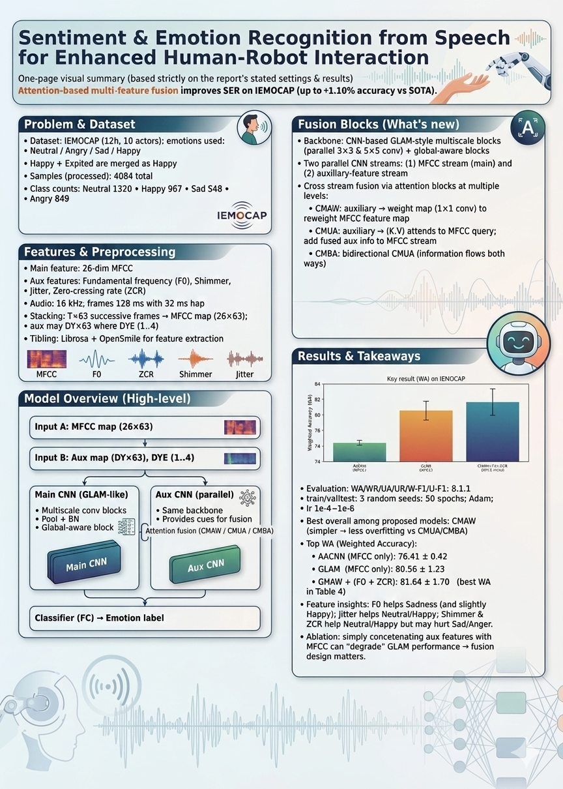

<p align="center">
  
</p>

# Sentiment and Emotion Recognition from Speech to Enhance Human-Robot Interaction

This repository contains the implementation and report materials for the project **Sentiment and Emotion Recognition from Speech to Enhance Human-Robot Interaction**.

The project studies **speech emotion recognition (SER)** for human-robot interaction and proposes an **attention-based multi-feature fusion framework** that combines MFCC with auxiliary speech features such as **fundamental frequency, zero-crossing rate, shimmer, and jitter**. The goal is to improve emotion recognition accuracy by enabling information exchange across different feature streams instead of simply concatenating them.

---

## Project Overview

Emotion plays an important role in natural communication. If machines can recognize emotion from speech more accurately, they can respond in a more natural and helpful way in human-robot interaction scenarios.

Many previous SER methods either:

- rely mainly on **MFCC** as the input feature, or
- combine multiple features through **direct concatenation**

This project proposes a different approach: using **attention-based feature fusion** to better transfer information between the main feature stream and auxiliary feature streams.

The proposed framework is built on a **CNN-based backbone** and introduces three different cross-modality attention mechanisms for feature fusion.

---

## Main Contributions

According to the report, the main contributions of this project are:

- A **novel multi-feature fusion method** for speech emotion recognition
- Three attention-based fusion blocks for information exchange between feature streams:
  - **CMAW**: Cross-Modality Attention Weighing
  - **CMUA**: Cross-Modality Unidirectional Attention
  - **CMBA**: Cross-Modality Bidirectional Attention
- Experimental validation on the **IEMOCAP** dataset showing improvement over strong benchmark models

---

## Method

### Input Features

The model uses:

- **MFCC** as the main feature
- **Fundamental frequency**
- **Zero-crossing rate**
- **Shimmer**
- **Jitter**

Audio is sampled at **16 kHz** and divided into **128 ms frames** with a **32 ms step**.  
Feature extraction is performed frame by frame, and multiple successive frames are stacked to form model input.

### Model Design

The framework uses two parallel CNN feature streams:

- one for the **main feature** (MFCC)
- one for the **auxiliary features**

The backbone includes:

- **multiscale feature extraction blocks**
- **global-aware blocks**
- **attention-based fusion blocks**

The three proposed feature-fusion methods are:

#### 1. CMAW — Cross-Modality Attention Weighing
Auxiliary features are used to generate attention weights for the main feature map, helping the model emphasize more informative regions.

#### 2. CMUA — Cross-Modality Unidirectional Attention
Auxiliary features are fused into the main feature stream through a unidirectional attention mechanism.

#### 3. CMBA — Cross-Modality Bidirectional Attention
Information flows in both directions between the auxiliary and main feature streams, allowing deeper cross-feature communication.

---

## Experimental Setup

### Dataset

Experiments are conducted on the **IEMOCAP** dataset.

The report uses the following emotion categories:

- neutral
- angry
- sad
- happy

Here, **happy** and **excited** are merged into the same class for consistency with prior work.

### Baselines

The proposed methods are compared with:

- **AACNN**
- **GLAM**

These benchmark models use **MFCC-only** input, while the proposed models use **MFCC + auxiliary features**.

### Evaluation Metrics

The report evaluates performance using:

- **WA**: Weighted Accuracy
- **WR**: Weighted Recall
- **UA**: Unweighted Accuracy
- **UR**: Unweighted Recall
- **W-F1**: Weighted F1
- **U-F1**: Unweighted F1

---

## Results

The experiments show that the proposed attention-based feature fusion methods can improve emotion recognition performance over strong benchmark models.

Key findings reported in the paper include:

- **CMAW** achieves the best overall performance among the proposed methods
- The best CMAW setting uses **fundamental frequency + zero-crossing rate**
- The proposed approach improves recognition performance over the benchmark **GLAM** model
- The report states that the proposed method achieves **up to about 1.0% improvement** over the current SOTA SER model on the IEMOCAP dataset

The report also notes that:

- **simple direct concatenation** of auxiliary features with MFCC does **not** work well
- the proposed **attention-based fusion blocks** are more effective than naive feature combination
- **CMAW** appears less prone to overfitting than CMUA and CMBA

---

## Repository Contents

A possible repository structure for this project is:

```text
.
├── data/
├── models/
├── scripts/
├── results/
├── figures/
├── Sentiment and Emotion Recognition from Speech to Enhance Human-Robot Interaction.pdf
└── README.md
```

You can adjust this structure based on your actual repository files.

---

## Future Work

As discussed in the report, possible future directions include:

- exploring new feature-fusion methods
- designing improved model architectures for multi-feature SER
- further studying how multiple speech features can be jointly used for more robust emotion recognition

---

## Reference

Project report:

**Xiangyi Deng**, *Sentiment and Emotion Recognition from Speech to Enhance Human-Robot Interaction*, Final Year Project Report, 2022–23.

---

## Notes

This README is based on the project report and is intended as a clean GitHub front-page introduction.  
You can further expand it by adding:

- installation instructions
- training commands
- inference examples
- dataset preparation steps
- result figures
- citation in BibTeX format
